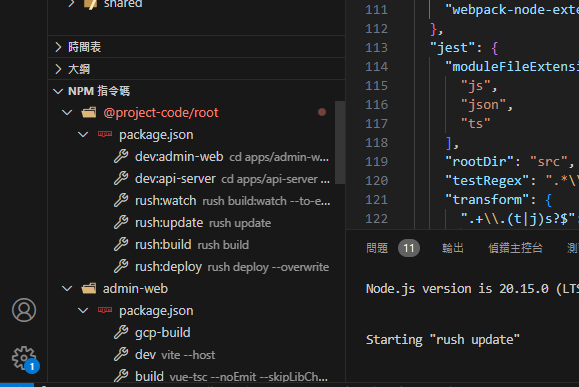

# Rush monorepo 模板

快速開始：

1. 安裝 rush：`npm install -g @microsoft/rush`
1. 安裝相依套件：`rush update`（推薦執行 root 中的 package.json scripts 之 `rush:update`）
1. ws-main.code-workspace 為目前共用的 workspace，可以複製一個自行使用。

    例：cod 的 workspace 為 ws-cod.code-workspace

1. VSCode 使用「檔案 -> 從檔案開啟工作區」，開啟 workspace 檔案

## 專案概述

本專案為基於 rush 的 monorepo，相關操作請詳閱 rush [文件](https://rushjs.io/zh-cn/pages/developer/everyday_commands/)

專案前後端溝通基於 [ts-rest](https://ts-rest.com/docs/intro) 實現端到端型別安全。

專案內容為：

- packages/shared：定義傳輸層合約資料或共用函式

  基於 TS，目前使用 tsup 編譯

- apps/api-server：實作 API 的 server

  基於 NestJS

- apps/admin-web：管理系統頁面

  基於 Vue。細節專案內[說明](./apps/admin-web/README.md)

### 驗證架構

目前基於 OAuth 2.0 之 JWT（JSON Web Token）實現，token 使用方式為：

- Access Token 由前端於 Authorization Header 提供。
- Refresh Token 儲存於 signed cookie 並指定 Path、SameSite、Secure。

> **為什麼不要每個請求都帶上 Refresh Token？**
>
> 因為風險不成比例。Refresh Token 壽命長、可換取新 Access Token。每多送一次，就多一次被攔截、被記錄到 server log、APM、代理、瀏覽器擴充套件的機會。

#### Access Token

前端儲存最佳實踐是放在記憶體中，因為這樣被 XSS 讀到的面積最小。

這時候你可能會問：「放在記憶體中，每次重新整理頁面，token 不就不見了？」

的確沒錯，這時候就和過期時一樣，用 Refresh Token 換新的 Access Token 惹。

> 當然如果想放在 LocalStorage 也不是不行，雖然會有 XSS 風險，但只要團隊大家說好就好。(◜௰◝)

不建議用 Cookie 自動帶到 API，Cookie 夾帶 Access Token 雖然方便，但瀏覽器自動發送，你就要自己處理 CSRF，而用 Authorization Header 天生較不易遭 CSRF。

#### Refresh Token

使用以下設定：

- HttpOnly
- Secure（只在 HTTPS）
- SameSite=Strict（必要時可以調整）
- Path=/auth/refresh（只跟 refresh 路徑一起送）。

以確保無法被任何 JS 存取，可以防止 XSS 這類攻擊。

> 以上只是理論上的最佳實踐，實際可以根據專案需求調整。

### 共用套件版本依賴

不同專案需要使用相同版本的套件時（例如 ts-rest、typescript），請在 package.json 中使用 '*'，其具體版本號在 common\config\rush\common-versions.json 中統一版本。

詳細說明請見[官方文件](https://rushjs.io/pages/configs/common-versions_json/)

## 腳本

> 💡 推薦使用 VSCode「npm 指令碼」功能
>
> 
>
> 如上圖，就可以直接在畫面右下角快速選擇要執行的腳本

root 中的 package.json 內含多個腳本

- `dev:{project-id}`：快速開啟對應專案的開發環境

  同執行自身專案中的 `npm run dev`

- `rush:watch`：執行編譯相依套件

  詳細說明請參閱 [watch mode](https://rushjs.io/zh-cn/pages/advanced/watch_mode/)

- `rush:update`：安裝相依套件

  變更依賴套件後，一般來說只要執行這個命令即可，另外兩個命令一情況而定：

  - `purge`：清空 node_modules 與快取，重新安裝所有套件。（懷疑快取壞壞時可以用）

  - `recheck`：強制檢查 lock 與 package.json 版本號匹配，可能會修改 lock 內的版本號

  其他詳細說明請見 [Rush update](https://rushjs.io/pages/commands/rush_update/)

- `rush:build`：執行所有專案的編譯

  同執行自身專案中的 `npm run build`

- `rush:deploy`：根據 deploy.json 中設定，複製部屬用內容至 common/deploy 中，--overwrite 表示若有已存在資料夾則強制覆蓋

  詳細說明請參閱 [Deploying projects](https://rushjs.io/pages/maintainer/deploying/)
